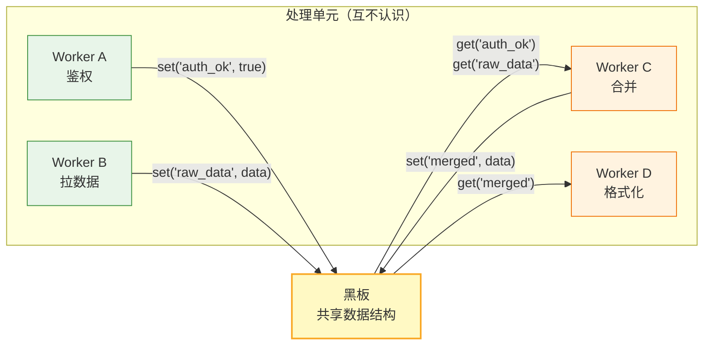
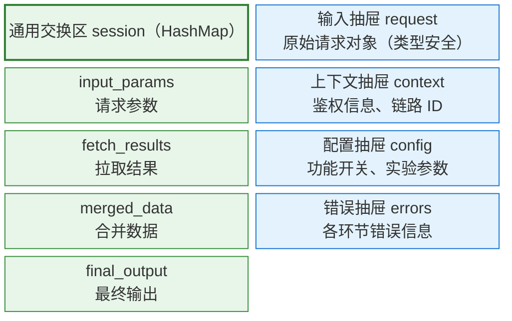
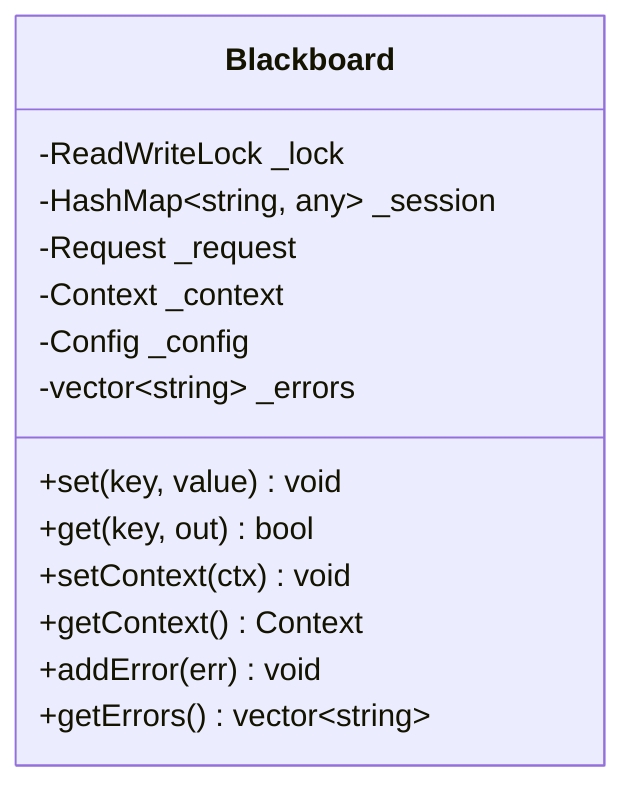

## 从一个朴素的困境说起

你在写一个请求处理流水线，有七八个步骤：鉴权、参数解析、多路数据拉取、缓存查询、数据合并、业务校验、格式化输出。最初你用函数链顺序调用，写着写着发现几个问题越来越痛。

第一，**步骤之间耦合越来越重**。A 算完要把结果传给 B，B 传给 C，每加一个新步骤就得改上一个函数的签名。某天产品说"加一路新的数据源"，你要动三四个地方。

第二，**数据传递靠参数列表**。步骤一多，函数参数就膨胀成

```cpp
void process(auth_result, params, source_a, source_b, cache_hit, merged, validated, ...)
```

每加一个字段所有调用点都要改。

第三，**没有统一的"现场"**。出了问题你很难回答"现在整个系统走到哪了、每一步产出了什么"——因为数据散落在各个函数的局部变量和返回值里。


这些问题有一个共同的解法：<mark><strong>不让步骤之间直接通信</strong>，而是放一块所有人都能读写的「黑板」</mark>。每个步骤只管往黑板上写结果、从黑板上读输入。这就是黑板模式。

## 把"函数互调"变成"大家一起看黑板"

想象一个办公室里的黑板。

张三上午在白板上贴了一张便利贴写着"鉴权已通过"，李四下午过来看到这张便利贴，就知道可以开始干活了。张三和李四不需要见面、不需要打电话、不需要约定见面时间——黑板就是他们唯一的通信媒介。


在软件里，这块"黑板"是一个共享的数据结构，所有处理单元（Worker）都通过它来读写数据。Worker 之间不互相调用、不持有对方指针。每个 Worker 只知道两件事：

1. 我要从黑板上**读**什么 key
2. 算完之后把结果**写**到什么 key



所有箭头都指向或来自黑板，Worker 之间没有任何直接连线。这就是黑板模式的本质：**解耦通信，共享状态**。

## 黑板模式的三个角色和四条约束

### 三大角色

| **角色** | **职责** |
| :----: | :----: |
| 共享数据 | 真正存数据；线程安全 |
| 处理单元 | 单一职责；只读写黑板，不互相调用 |
| 控制单元 | 决定谁先跑、谁后跑（可硬编码/事件驱动/DAG） |

### 四条约束

这四条约束是黑板模式的"宪法"，违反任何一条都会让系统的复杂度迅速失控。

1. **Worker 之间零直接耦合。** Worker A 不能调 Worker B 的方法，不能持有 B 的指针，甚至不能知道 B 的存在。如果 A 需要 B 的产出，它只能从黑板上读一个约定的 key。这是整个模式解耦的根基。

2. **Worker 必须无状态。** Worker 不存任何请求级的数据——所有中间结果都必须放到黑板上。这条约束让 Worker 天然可以被复用、替换、并发执行。如果你发现自己在 Worker 的成员变量里存了某个请求的中间结果，那就是违规了。

3. <mark><strong>黑板必须线程安全</strong></mark>。 多个 Worker 可能同时读写黑板，如果没有锁保护，就会出现数据竞争。最基础的实现是加读写锁；更精细的做法是对不同数据分区加独立的锁。

4. **数据交换走约定 key。** Worker 之间通过约定的 key 名来交换数据，这个 key 不在任何接口定义里，完全靠开发者之间的默契——所以叫"隐式协议"。好处是极其灵活，坏处是拼错一个字母就是静默失败。

## 共享数据结构的设计原则

一个好的黑板设计能让整个系统的数据流向清晰可追踪，而糟糕的设计则会让它退化成"全局变量"。

### 原则 1：黑板要分区而非扁平

最偷懒的做法是把黑板做成一个扁平的 `Map<string, any>`，所有数据混在一起。这在小规模下没问题，但步骤一多，key 的数量会爆炸，你根本分不清哪些 key 是输入数据、哪些是中间结果、哪些是控制信号。

更好的做法是**给黑板分区**——把数据按语义分成几个抽屉，每个抽屉内部再用 key-value 组织。



### 原则 2：写少读多，避免覆盖冲突

黑板上最危险的场景是**两个 Worker 同时写同一个 key**。一个 Worker 写了 `set("results", listA)`，另一个写了 `set("results", listB)`，后者直接把前者的数据覆盖了，而且没有任何报错。

解决方案有两个层次：

> 第一层是**约定每个 key 只有一个 Writer**——在团队规范里明确"谁写、谁读"。
> 第二层是在框架层面支持 **reducer 函数**：当多个 Worker 写同一个 key 时，不是直接覆盖，而是通过一个合并函数来组合（比如 append 到列表里）。

```cpp
// 朴素做法：覆盖式写入，容易冲突
blackboard.set("items", workerA_results)
blackboard.set("items", workerB_results)  // A 的数据没了

// 带 reducer 的做法：追加式写入
blackboard.append("items", workerA_results)  // 框架自动合并
blackboard.append("items", workerB_results)  // 两份数据都在
```

### 原则 3：key 的命名要有规范

因为 key 是"隐式协议"，命名混乱是黑板模式最常见的事故源。好的 key 命名应该能让你一眼看出三件事：谁写的、什么阶段产出的、什么类型的数据。

举几个好的命名：`fetch_source_a_results`（拉取阶段的 A 数据源结果）、`merge_candidates`（合并阶段的候选集）、`dedup_seen_ids`（去重用的已见 ID 集合）。举几个差的命名：`data`、`result`、`tmp`、`info`。

更进一步，可以在框架层做 key 的注册和类型校验——写入时检查 key 是否在白名单里、值类型是否匹配，编译期虽然不能报错，但至少能在运行时提前发现拼写错误。

### 原则 4：黑板的生命周期 = 一次请求

黑板不应该是一个"全局单例"，而应该**每个请求创建一个新实例**。请求结束后黑板就销毁，上面的所有数据一起释放。这样做有两个好处：一是没有跨请求的数据泄漏（上一次请求的残留不会影响下一次），二是天然支持并发——每个请求有自己的黑板，Worker 拿到的是当前请求的黑板引用，不会互相干扰。

请求进来 → 创建黑板（一个请求一个实例） → Worker 们在这块黑板上工作 → 请求结束 → 黑板销毁

## 完整的代码例子

```cpp
class Blackboard {
    // 通用交换区：灵活的 key-value 通道，加读写锁
    ReadWriteLock _lock;
    HashMap<string, any> _session;

    // 结构化抽屉：有明确类型的数据区
    Request _request;
    Context _context;
    Config _config;
    vector<string> _errors;

public:
    // 交换区 API：Worker 之间数据传递的主通道
    void set(string key, any value) {
        WriteLockGuard guard(_lock);
        _session[key] = value;
    }

    bool get(string key, any& out) {
        ReadLockGuard guard(_lock);
        if (_session.contains(key)) {
            out = _session[key];
            return true;
        }
        return false;  // key 不存在——静默失败，编译期不会报错
    }

    // 结构化抽屉 API：类型安全，不需要约定 key
    void setContext(Context ctx) { _context = ctx; }
    Context& getContext() { return _context; }

    void addError(string err) { _errors.push_back(err); }
    const vector<string>& getErrors() { return _errors; }
};
```

交换区的 set/get 灵活但脆弱（key 拼错不报错），结构化抽屉的 API 类型安全但不灵活（加一个字段要改类定义）。两者搭配使用：高频、跨模块的数据交换走交换区，有明确语义的结构化数据走抽屉。

黑板内部的样子是：



## 设计取舍：黑板模式并不是银弹

<mark><strong>key 协议的脆弱性</strong>是最大痛点</mark>。Worker 之间通过约定 key 交换数据，key 名拼错、类型搞错、忘了写某个 key——**编译期都不会报错，只会在运行时表现为"读不到数据"**。应对方法是在框架层做 key 注册和类型校验，或者尽量用结构化抽屉代替交换区。

**调试难度上升。** 因为 Worker 之间没有直接调用关系，出了问题不能沿着函数调用栈往下找。你需要知道"谁写了这个 key"、"谁依赖这个 key"、"执行顺序是不是我预期的"。好的可观测性建设（结构化日志、执行可视化）是这套模式落地的隐性前提。

### 跟其他模式的对比


看完图，关键区别就清楚了：

- **管道-过滤器**是流水线，数据单向流动，每一步的输出就是下一步的输入。适合 ETL 这类线性处理。
- **消息总线（Pub/Sub）** 是异步广播——发布者发完就走，不等消费者。适合<mark>跨系统的松耦合事件通知</mark>。
- **责任链**像传话筒，请求沿着链条传递，遇到能处理的就停下来。适合审批流、过滤器链。
- **中介者**有个主动的"中央大脑"在协调所有参与者。适合交互复杂、需要<mark>集中决策</mark>的场景（如航空管制）。
- **观察者**是一对多的单向通知——被观察对象变了，自动通知所有订阅者。适合事件驱动的 UI 更新。
- **黑板模式**的核心区别在于：它是**被动**的共享空间，没有中央大脑做决策，Worker 自己决定读什么写什么，由外部控制单元（DAG）来编排执行顺序。

## 黑板模式 + DAG：天作之合

黑板模式解决了"数据怎么共享"的问题，但没有解决"步骤按什么顺序执行"的问题。如果所有步骤都串行，那就退化成了一个慢吞吞的流水线。

真正让黑板模式发挥最大威力的搭档是 DAG（有向无环图）。DAG 负责"谁先谁后"的调度，黑板负责"数据在哪交换"。两者有一条天然的契约：**DAG 的边只表示先后顺序，不传值；值都在黑板上。** 这条性质让 DAG 的调度逻辑和黑板的数据交换逻辑完全解耦。

关于 DAG 的详细设计，参见另一篇笔记《DAG：有向无环图与执行调度》（待发布）。
