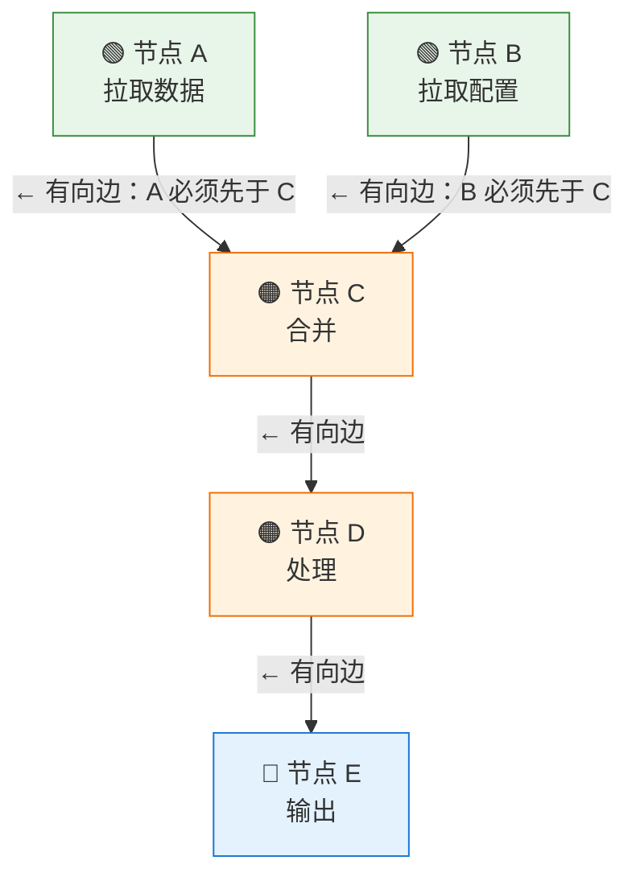
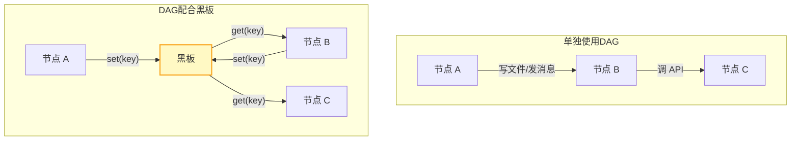
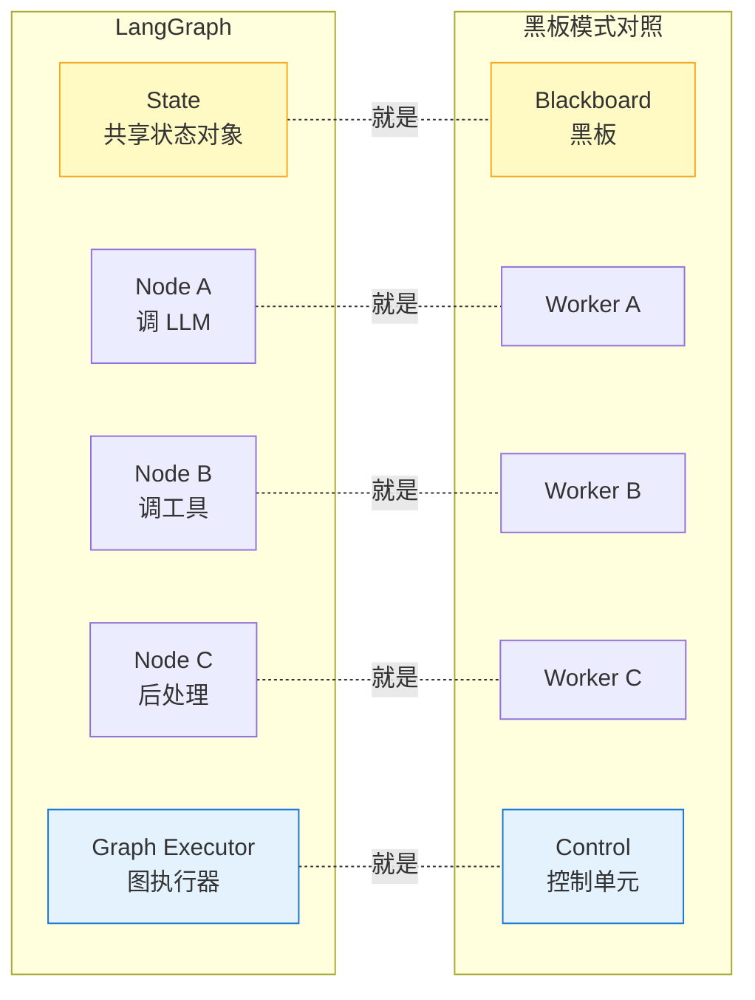
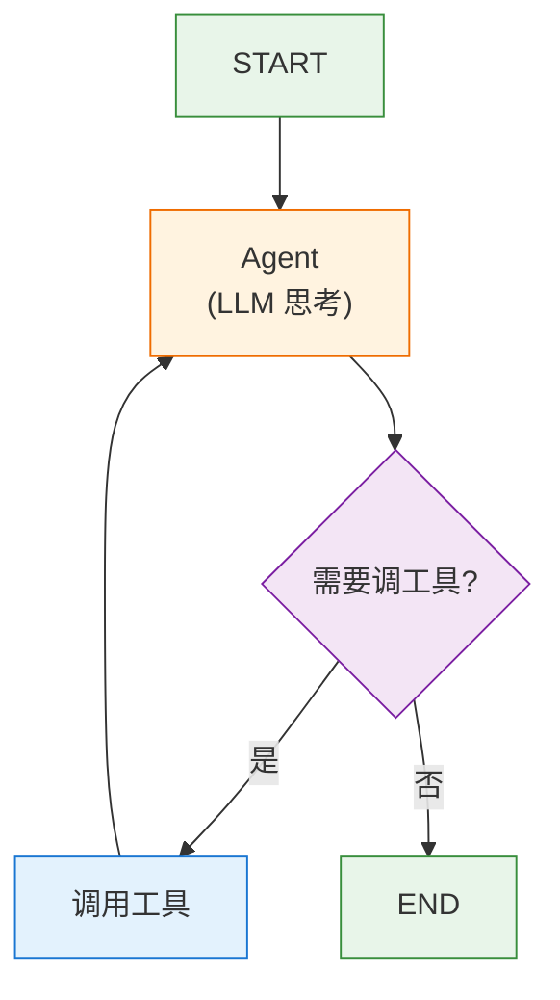
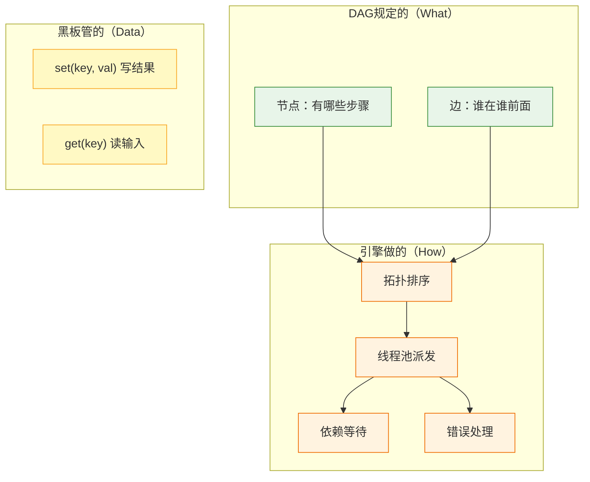

# 从一个问题说起

你有一堆处理步骤，它们之间的关系不是简单的线性链条——<mark><strong>有的步骤必须等另外几个步骤都跑完才能开始，有的步骤之间完全独立可以并发</strong></mark>。用一个比喻来说：你有一张装修的施工计划表。水电改造必须在砌墙之后，刷漆必须在布线之后，但厨房和卫生间可以同时进行。


如果你用代码硬写 ```
```cpp
stepA(); 
stepB(); 
stepC();
```
那就全是串行，白白浪费并行机会。如果你想手动管理并发（开线程、等 future、管依赖），代码会迅速膨胀成一团乱麻。

DAG 提供了一个干净的解法：**你只负责声明"谁在谁前面"，引擎负责"什么时候跑谁"。**

# DAG的基本概念与性质

DAG（Directed Acyclic Graph，有向无环图）就是一种"有方向、没有环"的图。把它放到执行调度的语境下，由下面三个概念组成：
1. **节点（Node）** = 一个操作步骤。比如"拉取数据"、"校验格式"、"合并结果"。
2. **有向边（Directed Edge）** = "先 A 后 B"的硬性约束。从 A 到 B 画一条有向边，意思是 B 必须等 A 跑完才能开始。
3. **无环（Acyclic）** = 沿箭头方向走，永远不会走回起点。如果存在 A→B→C→A 这样的回路，调度器就永远找不到谁先开始——这张图里不存在这种情况。

DAG 能用于执行调度的数学基础则依赖于下面三条：
**性质一：拓扑排序存在且不唯一。** 给定一张 DAG，你总能找到至少一种合法的线性执行顺序。比如上面的图，合法的拓扑排序有 A→B→C→D→E 和 B→A→C→D→E 两种。"不唯一"意味着调度器有优化空间——同一层的节点可以任意编排
**性质二：同层节点天然可并发。** 如果两个节点之间没有边相连，它们就是独立的，可以同时执行。这就是并行的来源。在上面的例子里，A 和 B 同层，可以同时跑。
**性质三：<mark><strong>边只表示先后，不传值</strong></mark>。** 这是最反直觉的一条。边从 A 指向 B，意思仅仅是"B 必须等 A 跑完才能开始"，至于 B 怎么拿到 A 的结果——DAG 不管。A 和 B 之间的数据交换走另一个通道（比如黑板模式的共享数据结构），**DAG 只负责时序**。
>正是第三条性质让 DAG 可以和黑板模式完美配合：DAG 管时序，黑板管数据，两者互不干扰。

# 引擎怎么调度DAG--以kahn算法为例
经典的调度算法是 **Kahn 算法**（拓扑排序的一种实现），思路出奇简单：

```
ready = 所有入度为 0 的节点（没有前驱，可以直接跑）

while ready 非空 or 有节点在跑:
    把 ready 里全部节点投到线程池（并发跑）
    等任一节点跑完
    把它指向的下游节点入度 -1
    入度归零的节点加入 ready
```

所谓"入度"就是一个节点被多少条边指向。入度为 0 意味着没有前置依赖，可以立即开始。一个节点跑完后，它所有下游的入度各减 1，减到 0 的那个下游节点就可以启动了。
让我们用上面的图走一遍：
```
初始状态:
  A(入度=0)  B(入度=0)  C(入度=2)  D(入度=1)  E(入度=1)
  ready = [A, B]

第一轮:
  并发执行 A 和 B
  A 跑完 → C 的入度 2→1
  B 跑完 → C 的入度 1→0 → C 加入 ready
  ready = [C]

第二轮:
  执行 C
  C 跑完 → D 的入度 1→0 → D 加入 ready
  ready = [D]

第三轮:
  执行 D
  D 跑完 → E 的入度 1→0 → E 加入 ready
  ready = [E]

第四轮:
  执行 E
  E 跑完，无下游
  ready = []，循环结束
```

整个算法的核心思想就一句话：**谁没有前置依赖就先跑谁，跑完就解锁下游节点。** 就这么简单。


DAG 本身只管"谁先谁后"，不管"数据怎么传"。根据数据传递方式的不同，DAG 的使用方式分两种：
1. **单独使用**（比如 Airflow、Argo）：节点之间靠写文件、发消息、调 API 来传值。DAG 定义了执行顺序，但每个节点要自己负责把结果传给下一个节点。适合节点间通信方式多样的场景（比如<mark><strong>跨进程、跨机器</strong></mark>）。
2. **配合黑板使用**：所有节点共用一块内存（黑板），值已经在黑板上了，DAG 的边只管时序。这让代码极其干净——你只需要声明"有哪些节点"和"谁在谁后面"，数据交换完全通过黑板的 set/get 完成。适合<mark><strong>单进程内多步骤协作的场景</strong></mark>。



关于黑板模式的详细设计，参见黑板模式：当步骤多到"理不清"的时候，让所有人看同一块白板


# DAG的工程实现：声明式构图 + 引擎调度
在实际项目里，DAG 的工程落地通常遵循一个模式：**业务代码只声明图的结构（What），引擎负责执行（How）。**
首先，DAG的节点应该是一个这样的数据结构：每个节点在运行时维护一个<mark><strong>原子计数器 dep_left_</strong></mark>，等价于 Kahn 算法里的"剩余入度"：
```cpp
struct NodeRuntime {
    std::atomic<int> state;         // 节点状态：READY / RUNNING / DONE
    std::atomic<int> dep_left_;    // ← 关键：剩余前置依赖数
    StrSet successors_;             // 下游节点集合
    StrSet dependents_;             // 上游节点集合
};
```
在项目里面的主线程/主入口进行<mark><strong>建图操作</strong></mark>
```cpp
GraphPtr createGraph() {
    auto graph = make_shared<Graph>("myGraph");

    // 1. 声明节点（只是登记，没有调用）
    auto fetchData   = getOp("FetchDataWorker");
    auto fetchConfig = getOp("FetchConfigWorker");
    auto merge       = getOp("MergeWorker");
    auto process     = getOp("ProcessWorker");
    auto output      = getOp("OutputWorker");

    addNode(graph, fetchData);
    addNode(graph, fetchConfig);
    addNode(graph, merge);
    addNode(graph, process);
    addNode(graph, output);

    // 2. 声明先后（只是规则，没有线程、没有 await）
    graph->addEdge(fetchData->name(),   merge->name());
    graph->addEdge(fetchConfig->name(), merge->name());
    graph->addEdge(merge->name(),       process->name());
    graph->addEdge(process->name(),     output->name());

    return graph;  // 业务代码到此结束——整个函数没有任何"执行"动作
}
```

 建图完成以后，由Kahn 算法构成的「引擎」完成落地实现

```
1. 初始化：遍历所有节点，计算每个节点的 dep_left_（入度）
2. 首轮派发：dep_left_ == 0 的节点 → 全部扔进线程池并发执行
3. 节点完成回调（nodeComplete）：
     遍历该节点的所有 successors_
     对每个后继原子递减 dep_left_
     如果某个后继的 dep_left_ 减到 0 → 立即派发到线程池
4. 重复步骤 3，直到所有终端节点（无后继的节点）完成
5. 通过 CountDownLatch 唤醒主线程，本次 DAG 执行结束
```

用伪代码表示核心循环：
```cpp
void asyncRun() {
    for (auto& node : all_nodes) {
        if (node.dep_left_ == 0) {
            threadPool.submit([=] { runNode(node); });
        }
    }
    end_node_latch_.wait();  // 阻塞直到所有终端节点完成
}

void nodeComplete(NodeRuntime& node) {
    for (auto& succ_name : node.successors_) {
        auto& succ = getNode(succ_name);
        if (succ.dep_left_.fetch_sub(1) == 1) {  // 原子减，返回旧值
            // 旧值是 1，减完就是 0 → 后继就绪
            threadPool.submit([=] { runNode(succ); });
        }
    }
    if (node.successors_.empty()) {
        end_node_latch_.countDown();  // 终端节点完成，计数减 1
    }
}
```

这段代码最精妙的地方是 fetch_sub(1) == 1：原子递减并返回旧值，如果旧值是 1，说明减完变 0，该节点的所有前驱都跑完了，可以立即派发。**整个过程没有全局锁，没有预排序，完全靠原子操作和事件回调驱动。**

## 工程实现需要注意的细节：

**线程池复用**：**引擎使用 RecycleThreadPool，线程按需创建、空闲回收**，避免每个请求都创建线程的开销。可以通过 setParallelNum(n) 限制最大并发数。

**串行降级**：同一个引擎提供 SerialExecutor 模式，把所有节点串行执行（等价于 parallelNum = 1）。调试时特别有用——日志变成线性的，不用在多线程交错的日志里大海捞针。

**超时节点**：框架支持注册"超时节点"——如果某个前驱跑得太久，超时节点会被提前触发，可以做降级处理（比如跳过该步骤、返回默认值），避免整个请求卡死。

**终止条件**：用一个变量CountDownLatch 实现。latch 初始值 = 终端节点数（没有后继的节点），每个终端节点完成时 countDown()，主线程 wait() 直到计数归零。比轮询检查"所有节点是否完成"高效得多。
# DAG与 LangGraph 的关系：DAG 在 LLM Agent 时代的进化

传统的调度主要用于数据处理流水线——步骤固定、依赖明确、跑完就结束。但当 DAG 遇上 LLM Agent 场景，产生了一个有趣的进化：**LangGraph**。

>LangGraph 是什么?
	LangGraph 是 LangChain 团队推出的框架，用于构建有状态的 LLM Agent 应用。它的核心思想就是<mark><strong>把 Agent 的工作流建模为一张图</strong></mark>——节点是处理步骤（LLM 调用、工具调用、数据转换），边是步骤之间的流转关系，所有节点共享一个 State 对象。

如果你读过黑板模式的笔记，会发现 LangGraph 的架构和黑板模式惊人地吻合：
- **State = Blackboard。** **LangGraph 的 State 是一个 Python 字典**（用 TypedDict 或 Pydantic 定义），所有节点共享同一个 State 对象。每个节点从 State 里读自己需要的字段，处理完后把结果写回 State。这和黑板模式的"所有 Worker 通过共享黑板交换数据"是同一回事。
- **Node = Worker。** 每个节点是一个 Python 函数，接收 State、返回部分更新。节点之间不互相调用——它们只和 State 交互。
- **Graph Executor = Control。** **编译后的 StateGraph 负责调度**：解析图的拓扑结构、决定哪些节点可以并发执行、等待依赖完成后触发下游。


## 更强大的数据交换：State + Reducer 机制

LangGraph 在黑板模式的基础上做了一个重要增强：**Reducer 函数**。
在传统黑板模式里，如果两个 Worker 同时写同一个 key，后写的会覆盖先写的。
LangGraph 的 State 支持通过 Annotated 类型配置 reducer，当多个节点写同一个字段时，不是简单覆盖，而是通过合并函数来组合。

```python
from typing import Annotated
from typing_extensions import TypedDict
import operator

class AgentState(TypedDict):
    # messages 字段使用 add reducer：新消息追加到列表，而不是覆盖
    messages: Annotated[list, operator.add]
    # current_query 字段使用默认 reducer：后写覆盖先写
    current_query: str
```

这就好比黑板的交换区不再只是"贴便利贴"，而是有一个管理员：你说"往 messages 区追加一条"，管理员帮你把新便利贴贴到旧便利贴旁边，而不是撕掉旧的。

## 更广义的任务调度结构：支持环路的图

LangGraph 和传统 DAG 调度最本质的区别是：**LangGraph 支持环路（cycles）。**

传统 DAG 严格要求无环——因为环意味着循环依赖，拓扑排序无法完成。但在 LLM Agent 场景里，环路是刚需：
- **ReAct 循环**：LLM 思考→调用工具→观察结果→再思考→再调工具→直到得出答案。这本身就是一个环。
- **反思与自我修正**：生成→评估→不合格→重新生成→再评估→合格→结束。这也是一个环。
- **人机交互**：执行到一半暂停→等人类审批→根据审批结果继续或回退。


LangGraph 用<mark><strong>条件边（conditional edges）</strong></mark>来实现环路：在某个节点之后，根据当前 State 的内容动态决定下一步走向。如果条件函数返回"继续"，就走回前面的节点形成环路；如果返回"结束"，就走向 END 节点。

>注意：虽然 LangGraph 支持环路，但图中的**无环部分仍然按 DAG 的方式调度**。也就是说，DAG 调度是 LangGraph 的子集——任何可以用传统 DAG 表达的工作流，在 LangGraph 里都能自然运行。


## 设计取舍

DAG 调度是一套非常优雅的方案，但它也有自己的局限。
- **静态 vs 动态。** 传统 DAG 是静态的——构图在代码里写死，运行时不会变。如果你的流程需要根据运行时数据动态调整结构（比如"如果 A 的结果质量不好，就多加一路数据源重试"），要么用条件边（LangGraph 的做法），要么在运行时动态构图（代码里用 if/else 决定加哪些节点和边）。
- **可观测性是隐性成本。** DAG 的执行顺序不是代码里直接写出来的，而是引擎根据图结构动态计算出来的。出了问题你很难直接看出"引擎到底先跑了谁后跑了谁"。好的 DAG 框架应该支持导出图结构（比如 Graphviz 格式）和执行轨迹日志。
- **错误处理需要特别设计。** 某个节点执行失败了怎么办？是跳过这个节点继续？是整张图终止？还是重试？DAG 本身不回答这个问题，需要<mark><strong>在框架层设计统一的错误处理策略</strong></mark>（比如每个节点配一个 skipOnError 开关，或者全局的重试策略）。
- **简单场景不需要 DAG。** 如果你的流程只有三四个步骤、全是线性的，那直接 stepA(); stepB(); stepC(); 就够了。引入 DAG 的开销（构图、引擎、调试复杂度）不值得。DAG 的价值在"步骤多、依赖复杂、需要并发"的场景下才真正体现。
# 一张图收尾黑板模式+DAG

